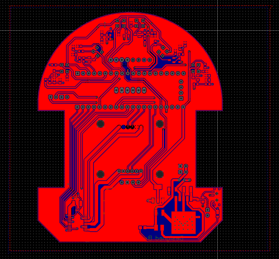
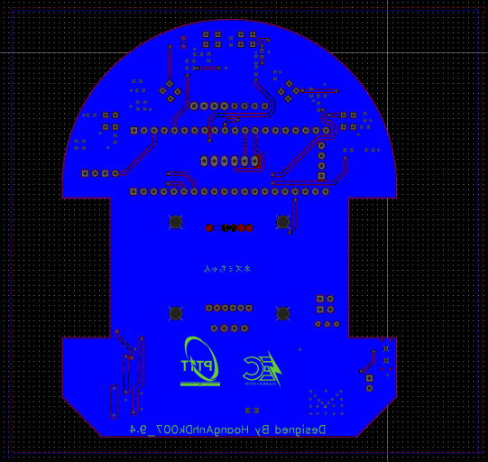
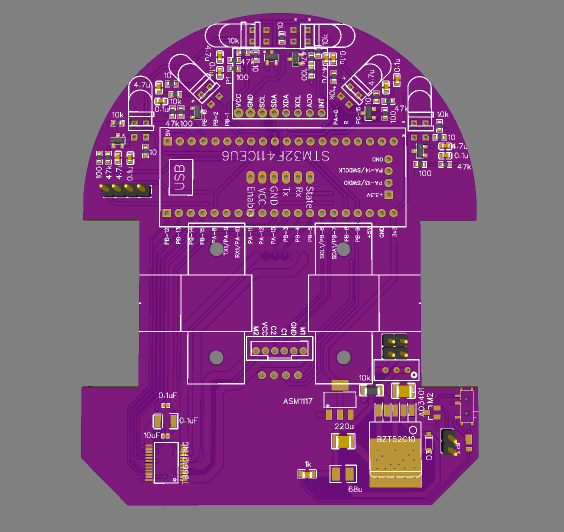
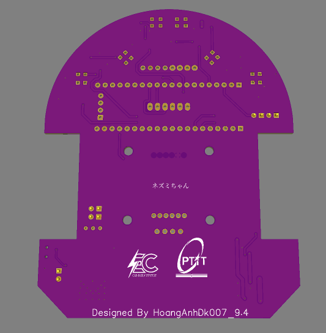
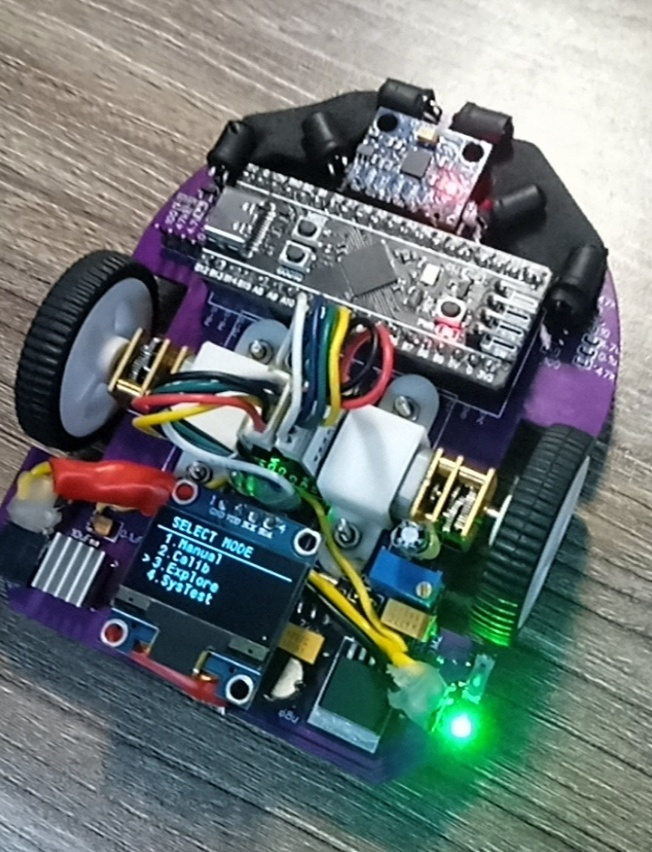
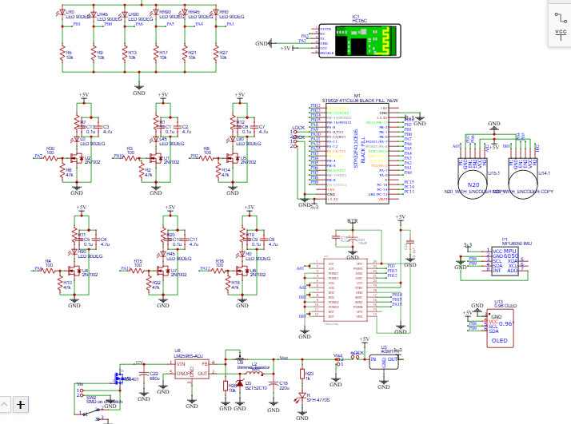

# Nezumi Chan Micromouse Firmware

A micromouse robot control firmware running on `STM32F411CE` (Black Pill), developed bare-metal using `CMSIS` without HAL. This project provides a complete firmware stack for a compact maze robot to experiment with maze exploration algorithms, optimal path re-running (A*), IR sensor calibration, wall following, smooth turns, and real-time telemetry via BLE.

Currently, the firmware is configured for a **5x5 practice maze** with the goal cell at `(4,4)`. Some function names retain classical micromouse terminology (e.g., `Center`), but in the current configuration, they refer to the **goal cell** of the test setup.

## Key Features

- Motion control featuring quadrature encoders + MPU6050 + heading/speed PID loops
- 6-channel IR wall sensing system with multi-step calibration and hysteresis
- Maze solver with flood-fill exploration, persistent map storage, and A* path execution
- Flash persistence for maze map, IR calibration, and MPU calibration in internal flash
- Onboard OLED menu for direct robot interaction and operation
- BLE debug console for real-time logging and 2D maze visualization
- Dedicated System Test menu to isolate and test individual motion & sensor primitives

## Requirements & Environment

- MCU: `STM32F411CE`
- Build System: `PlatformIO`
- Framework: `cmsis`
- Upload Protocol: `ST-Link`
- On-robot UI: `SSD1306 OLED`
- Inertial Sensor: `MPU6050`
- Debug Transport: `USART2 + JDY-33 BLE`

## Hardware Showcase

### 1. PCB Layers (Front & Back)
| Top Layer (Front) | Bottom Layer (Back) |
| :---: | :---: |
|  |  |

### 2. 3D Render Preview (Front & Back)
| Top Preview (Front) | Bottom Preview (Back) |
| :---: | :---: |
|  |  |

### 3. Real Prototype & Schematic Diagram
| Real Prototype | Schematic Diagram |
| :---: | :---: |
|  |  |

## Hardware & Pinout Mapping

Complete macro definitions are located in `include/pinout.h`. Key pin assignments:

| Subsystem | Pin Assignment |
|---|---|
| Motor PWM | `PA15`, `PB3` via `TIM2` |
| Motor DIR | `PB12`, `PB13`, `PB14`, `PB15` |
| Encoders | `TIM3` (`PB4/PB5`), `TIM4` (`PB6/PB7`) |
| IR Receiver (ADC) | `PB1`, `PB0`, `PA6`, `PA5`, `PA4`, `PA1` |
| IR Emitter (TX) | `PA7`, `PB10`, `PB2`, `PA8`, `PA11`, `PA12` |
| I2C | `PB8` (SCL) / `PB9` (SDA) |
| OLED | I2C address `0x3C` |
| MPU6050 | I2C address `0x68` |
| BLE (JDY-33) | `USART2` on `PA2` (TX) / `PA3` (RX) |
| User Button | `PA0` |
| Status LED | `PC13` |

Robot Physical Parameters (configured in firmware):

- Cell size: `180.0 mm`
- Wheel diameter: `35.0 mm`
- Wheel base: `84.0 mm`
- Encoder PPR: `1430`

## Repository Structure

```text
.
|-- README.md
|-- platformio.ini
|-- assets/
|   |-- reallife.jpg
|   |-- topPreview.png
|   |-- bottomPreview.png
|   |-- topPCB.png
|   |-- bottomPCB.png
|   |-- schematic.png
|   `-- webBLEDebug.png
|-- docs/
|   |-- architecture.md
|   `-- archive/
|-- include/
|-- lib/
|-- src/
`-- tools/
    |-- README.md
    `-- ble_debug_console.html
```

### Directory Overview

- `src/`: Complete C firmware source code
- `include/`: Public header files for all modules
- `assets/`: Hardware photos, PCB layouts, schematics, and web console screenshots
- `docs/architecture.md`: Module architecture, runtime flows, and extension points
- `tools/ble_debug_console.html`: Web Bluetooth console for viewing logs and rendering maze state

## Firmware Module Map

### 1. Application Layer

- `src/main.c`: System entry point, main menu loop, explore/A* state machine
- `src/systemTest.c`: System test menu and primitive test routines

### 2. Motion and Control

- `src/motion_controller.c`: Straight driving, in-place turns, smooth turns, trapezoidal speed profiling, PID loops
- `src/pid.c`: Generic PID controller implementation
- `src/back_align.c`: Reverse wall alignment primitive to re-reference robot pose

### 3. Sensing and Calibration

- `src/ir_sensor.c`: 6-channel IR emitter pulsing and ADC DMA sampling
- `src/ir_simple_calib.c`: Multi-step calibration routine and wall detection threshold computation
- `src/mpu6050.c`: I2C driver for gyroscope and yaw tracking
- `src/sensor_fusion.c`: Fuses encoders, gyro, and IR sensors to generate fused state estimates for control

### 4. Navigation and Persistence

- `src/maze_solver.c`: Flood-fill exploration, smart unknown-cell prioritization, A* shortest path solver, BLE maze exporter
- `src/flash_storage.c`: Saves and restores maze map and calibration profiles to/from internal Flash sectors

### 5. Platform Drivers

- `src/hardware.c`: Low-level peripheral initialization (GPIO, ADC, Timers, Motors, safety hooks)
- `src/system_timer.c`, `src/timer.c`: System timebase and hardware timer helpers
- `src/encoder.c`: Quadrature encoder interface via timer hardware
- `src/i2c.c`: I2C driver (blocking + DMA)
- `src/uart.c`: Debug UART transport
- `src/bt_debug.c`: UART2 BLE transport wrapper
- `src/tb6612fng.c`: Dual H-bridge motor driver

### 6. User Interface

- `src/ssd1306.c`, `src/fonts.c`: SSD1306 I2C OLED display driver and font rendering

## Main Execution Flow

1. `main()` initializes peripherals, UART/BLE, OLED, encoders, IR sensors, motors, and MPU6050.
2. Loads persistent data from internal Flash: maze map, IR calibration, and MPU gyro offsets.
3. Renders the interactive menu on the OLED.
4. User interacts via a single push button:
   - Short press: Cycle through menu options
   - Long press: Execute selected mode
5. During Maze Exploration / A* Run:
   - Read wall presence via IR sensors
   - Update maze wall data
   - Compute next optimal cell target
   - Execute coordinated motion primitive
   - Stream telemetry logs and cell update packets over BLE

## Main Menu Modes

| Mode | Description |
|---|---|
| `1.Calibration` | Runs the interactive IR and MPU calibration routine |
| `2.Run Slow` | Slow-speed maze exploration mode for safe observation |
| `3.Run Faster` | Higher-speed exploration mode |
| `4.A* Run` | Executes the optimal shortest path using the stored maze map |
| `5.Speedrun` | Speedrun mode (placeholder / WIP) |
| `6.Reset Map` | Clears the persistent maze map from internal flash |
| `7.System Test` | Enters the hardware and motion primitive test suite |

## System Test Suite

| Test | Description |
|---|---|
| `1.IR` | Live sensor readings & wall detection threshold verification |
| `2.Align` | Front wall alignment test |
| `3.Pivot` | In-place pivot & smooth turn verification |
| `4.TrStr` | Transition straight movement test |
| `5.TrTn` | Transition turn movement test |
| `6.SPHT` | Sensor Presence Hysteresis Test |
| `7.T1WT` | One-wheel turn / smooth turn trigger test |

## BLE Debug Web Console

<p align="center">
  
</p>

Open [tools/ble_debug_console.html](tools/ble_debug_console.html) using a Web Bluetooth-supported browser (e.g., Google Chrome or Microsoft Edge on desktop).

Console capabilities:

- Connects to the JDY-33 Bluetooth module via Web Bluetooth API
- Live stream text log viewing
- Real-time 2D rendering of the maze grid, flood values, planned path, and robot pose
- Handles step-by-step `CELL:` update packets and complete `MAZE:` memory dumps

For further details, refer to [tools/README.md](tools/README.md).

## Build & Flash

### Prerequisites

- `PlatformIO Core` / `PlatformIO IDE`
- `ST-Link` v2 programmer
- `STM32F411CE` development board connected with appropriate drivers

### Build Commands

```bash
pio run
pio run -t upload
pio device monitor -b 115200
```

### Current PlatformIO Configuration

- Environment: `genericSTM32F411CE`
- Framework: `cmsis`
- Upload Protocol: `stlink`

## Recommended Operational Workflow

### Initial Bring-up

1. Flash firmware to the target MCU.
2. Select `1.Calibration` on the OLED menu.
3. Complete all on-screen calibration steps for IR sensors and MPU gyro.
4. Select `2.Run Slow` to verify exploration behavior, wall sensing, and telemetry logs.
5. Monitor real-time navigation progress via the BLE Web Console.
6. Once the target cell has been explored and the map is confirmed, run `4.A* Run` to perform the optimal path run.

### Maintenance & Mechanical Adjustments

1. Reset the map if previous wall data is no longer valid.
2. Re-run the calibration routine.
3. Validate individual motion and sensor primitives in `7.System Test` before running autonomous exploration.

## Calibration & Persistent Data

### Internal Flash Layout

- `Sector 6 @ 0x08040000`: IR calibration profile
- `Sector 6 + 256`: MPU gyro calibration offsets
- `Sector 7 @ 0x08060000`: Persistent maze map data

### Key Benefits

- **IR Calibration**: Matches detection thresholds to individual sensor characteristics and ambient conditions.
- **Persistent Maze Storage**: Retains wall and explored cell information across power cycles and resets.
- **MPU Calibration**: Minimizes gyroscope zero-rate drift to ensure accurate yaw angle tracking during high-speed motion.

## Supplementary Documentation

- [Firmware Architecture](docs/architecture.md)
- [Session Changelog (2026-03-20)](docs/archive/2026-03-20-session-changes.md)
- [Legacy Calibration Walkthrough](docs/archive/ir-calibration-walkthrough.md)

## Current Limitations

- `main.c` and `systemTest.c` serve as central orchestrators and contain significant logic
- `Speedrun` is currently a placeholder
- Maze dimensions are currently configured for `5x5` testing rather than a competition `16x16` grid
- If scaling to a larger maze size, verify BLE packet formatting and Web Console memory limits

## Porting & Customization Guide

To adapt this codebase to a different robot platform or chassis:

1. Update pin assignments in `include/pinout.h`.
2. Verify motor directions and encoder polarities in `motion_controller.c` and `hardware.c`.
3. Re-calibrate IR sensor thresholds using the onboard calibration menu.
4. Test and tune each motion primitive using the `System Test` suite.
5. Modify maze dimensions or solver heuristics as required.
