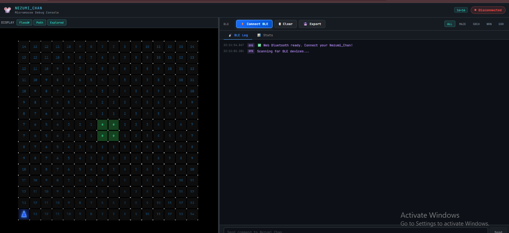

# Host Tools

## BLE Debug Console

  

The `ble_debug_console.html` is a standalone host-side web application designed to:

- Connect to the robot via Web Bluetooth API (JDY-33 BLE module)
- Monitor real-time UART/BLE log streams
- Render live 2D maze walls, flood-fill distance maps, calculated path, and robot pose

### Getting Started

1. Open `ble_debug_console.html` using a Chromium-based browser (Google Chrome or Microsoft Edge).
2. Power on the robot and the JDY-33 BLE module.
3. Click the **Connect BLE** button in the console header.
4. Select the Bluetooth device broadcasting the `0xFFE0` service.

### Notes

- The console is currently synced with the firmware's **5x5 maze configuration**.
- The robot sends `CELL:` packets for incremental step updates and `MAZE:` packets for complete maze dumps.
- If you change the maze dimensions in the firmware, update the corresponding constants in `ble_debug_console.html`.
